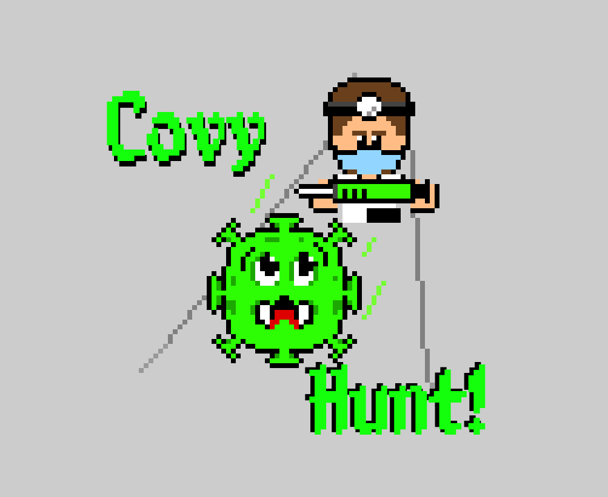

Version 0.0.1

# Documentation

This game was built using Typescript on a javascript engine for 2D games called Phaser Game Framework  (version 3.55.2) and uses Parcel as a builder.

## Typescript

TypeScript is a strongly typed programming language that builds on JavaScript, giving you better tooling at any scale.

TypeScript adds additional syntax to JavaScript to support a tighter integration with your editor. Catch errors early in your editor.

More information can be found at [typescriptlang.org](https://www.typescriptlang.org/)

## Phaser

Phaser 3 is the next generation of the Phaser Game Framework. Every last element has been rebuilt from scratch using a fully modular structure, combined with a data-orientated approach. It includes a brand-new custom WebGL renderer designed specifically for the needs of modern 2D games. 
Source: [Welcome to Phaser 3](https://phaser.io/phaser3)

Full documentation can be found at [https://phaser.io/](https://phaser.io/)

## Parcel

The zero configuration build tool for the web an can handle JavaScript, CSS, HTML, TypeScript, Node, React, Vue, CoffeeScript, Electron and more.

Full documentation can be found at [https://parceljs.org/](https://parceljs.org/)

## Game structure

The game starts at index.html which calls [main.ts](../src/main.ts) responsible for config Phaser and create the Game instance.

In the configuration object you can see the main scenes passed by parameter, where the main flow occurs.

Each scene object has its own responsibility:

* **Preloader**: The scene [Preloader.ts](../src/scenes/Preloader.ts) is responsible for loading all primary game assets, like of the images, sprite sheets, maps, layers and more.

* **GameScene**: The scene [GameScene.ts](../src/scenes/GameScene.ts) is the center of the project, responsible for instantiate the actor objects (sprites), define collision handlers as well as startup help and game over handler.

* **GameUI**: The scene [GameUI.ts](../src/scenes/GameUI.ts) cares of UI indicators like health, injection and coin counters by handling special events to treat them.
 
Additionally in [main.ts](../src/main.ts) there is a interface with external HTML pages.
 
In the HTML pages you will find blocks of Section elements for each of the three stages: Welcome screen, Game screen, post game over screen and Ranking. 

## Application modules
 
### Storage 

To provide a simple ranking for the game, the application relies on [LocalStorage](https://developer.mozilla.org/en/docs/Web/API/Window/localStorage) which is a public session storage. In the LocalStorage some key=value data is stored. The option for LocalStorage makes sense once the game does not use any user's confidential information, only ranking (initials, date time and score). 

### Animations 

Each animated object has its own handler file located at [animations folder](../src/animations) for organization purpose.

### Maps

To create all maps [Tiled](https://www.mapeditor.org/) was used. Tiled is a reliable and useful for block game development. Once the game uses 2D style, it was essential for the development because of layer division and definition of custom properties, which allows to set collisions that can be mapped by Phaser later on to identify different kind of objects as well as object positioning.
        

